# SQL Practice
<!-- https://sqlbolt.com/ -->

SQL (structured Query Language) is designed to allow technical and non-technical users to interface with data from a relational database, which represents a collection of related tables with a fixed number of named columns and any number of data rows.

## SQL Queries

A query, or a **SELECT** statement is used to retrieve data from a SQL database by stating what we are looking for, where to find it, and what may need to happen to it before it is returned. A basic query would take on the structure of

`SELECT column, another_column, ...`

`FROM mytable;`

or, alternatively, you would use an asterisk in the SELECT portion of the query to select all of the columns.

To add a constraint to your search, you would add a **WHERE** statement to your query, ex.

`WHERE condition(s)`

After your **WHERE** statement, you can add extra conditions such as **AND**, **OR**, **BETWEEN... AND...**, **NOT BETWEEN... AND...**, **IN(...)**, **NOT IN(...)**, and standard numerical operators for anything involving numbers.

When dealing with characters, you can use the standard equality/inequality comparison operators, along with _, %, **LIKE**, **NOT LIKE**, **IN(...)**, and **NOT IN(...)**.

If you don't want anything with duplicate values, you would use `SELECT DISTINCT column, another_column`, which filters out results that have the same value in the selected column.

To put your results in any specific order, you would add `ORDER BY column ASC/DESC` at the end of your query. This sorts the rows alphanumerically based on the value of the data contained in the column. Following **ORDER BY**, you can also add `LIMIT num_limit OFFSET num_offset` which indicates the subset of results you're looking for. **LIMIT** reduces the number of rows returned and **OFFSET** specifies where to begin counting from.

Database normalization minimalizes duplicate data in any single table and allows for data to grow independantly. Tables with shared information will have a primary key linking them which can be used with **JOIN** to combine row data across two separate tables. **INNER JOIN** matches rows from the first and second table with the same key, defined by **ON** to create a results row with the combined columns from the two tables.
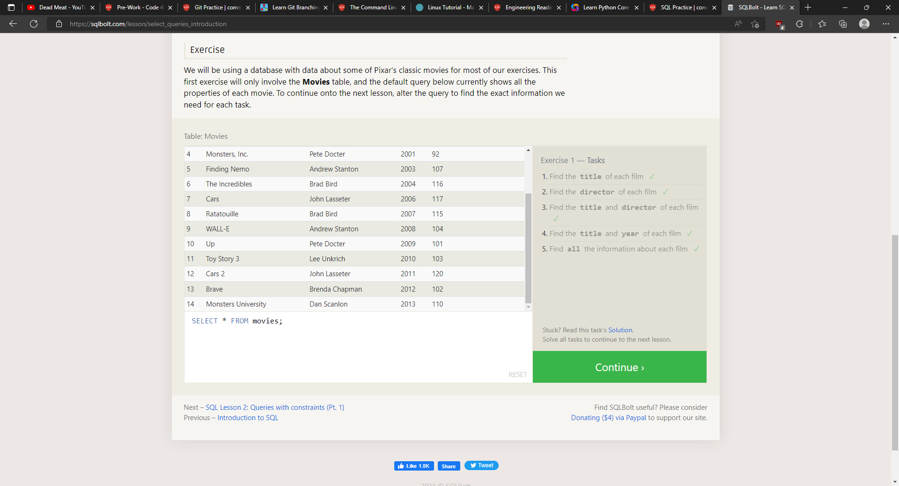
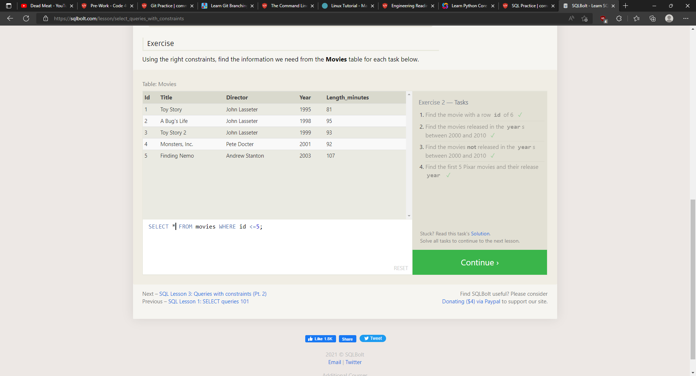
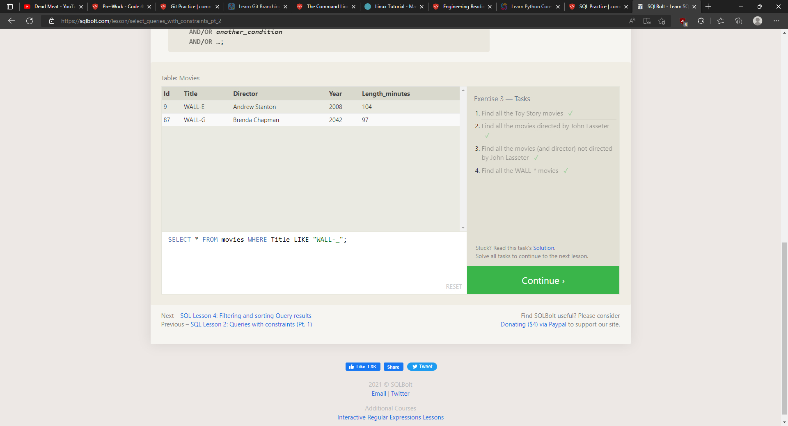
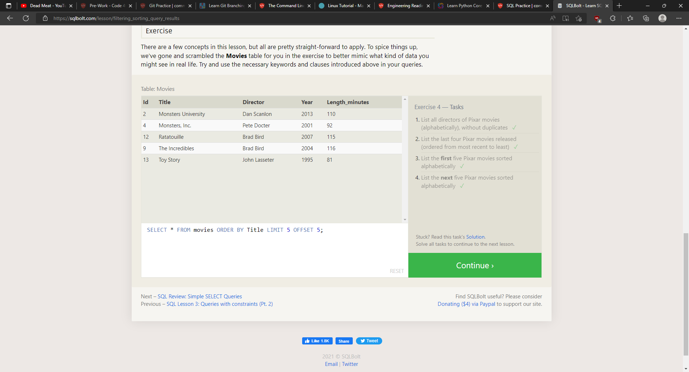
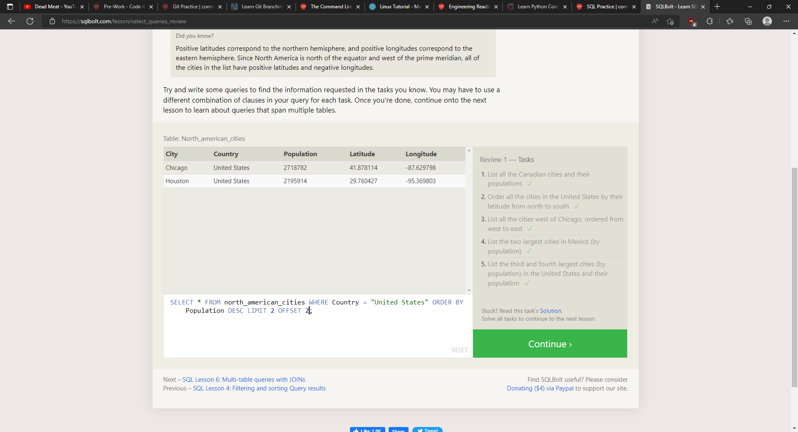
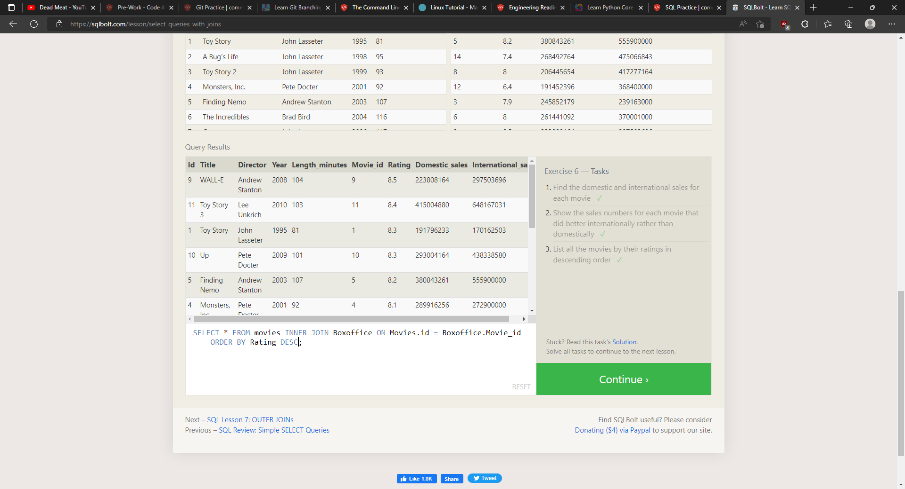

## Database Management

A database schema describes the structure of each table and the datatypes it contains. To add new data to a database, you use **INSERT** to define the table and columns being written to and how many rows to insert. **VALUES** defines all of the data that is being entered. If your table supports default data, you can add values to only specific columns, otherwise a value must be specified for every available column.

You also have the ability to update data using **UPDATE** and specifying the table, then specifying the data to be added with **SET** and where the data should be changed with **WHERE**.

If you need to delete data from a table, you can use a **DELETE FROM** statement which describes the correct table and the rows within said table that will be deleted using **WHERE**. Without using **WHERE**, all rows in the table will be cleared out.

If you want an entirely new table, you can create it using the **CREATE TABLE** statement. Optionally, you can add the constraint **IF NOT EXISTS** to ensure you do not already have a table with the same name, in which case your program would throw an error. When you create the table, you will need to specify the name of each column, its datatype, and an optional constraint on whether the value is inserted and an optional default value. The different accepted data types are INTEGER, BOOLEAN, FLOAT, DOUBLE, REAL, CHARACTER(max_amount), VARCHAR(max_amount), TEXT, DATE, DATETIME, and BLOB. The different accepted constraints are PRIMARY KEY, AUTOINCREMENT, UNIQUE, NOT NULL, CHECK(expression), and FOREIGN KEY

As your database grows, you can use **ALTER TABLE** to update schemas to add, remove, or modify columns and table constraints. **ADD** will add a new column with the same syntax as **CREATE TABLE**. In some databases, you also can specify where the column will be placed using **FIRST** or **AFTER**. To remove a column, all you need to do is use **DROP** and list the name of the column to be removed. To rename the table as a whole, you would use **RENAME TO**.

If you want to remove a table entirely from the database rather than just clearing it out, you would use **DROP TABLE** with the optional **IF EXISTS** to keep your program from throwing an error if there is no such table.

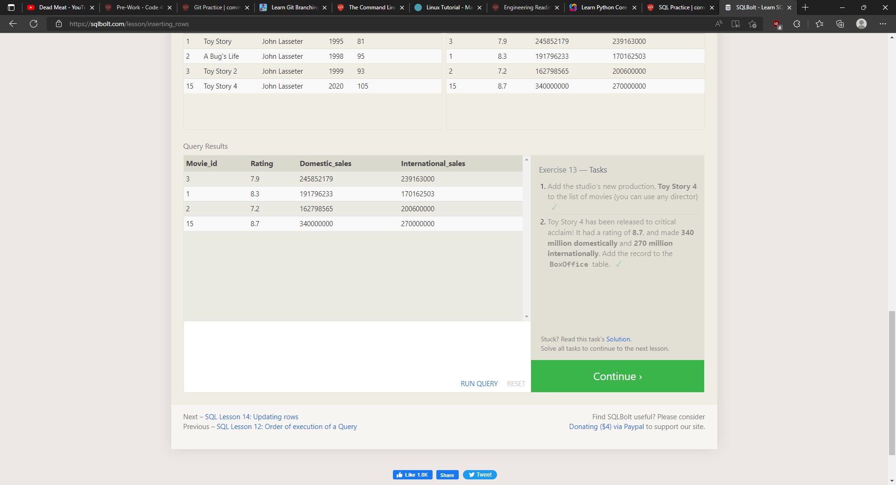
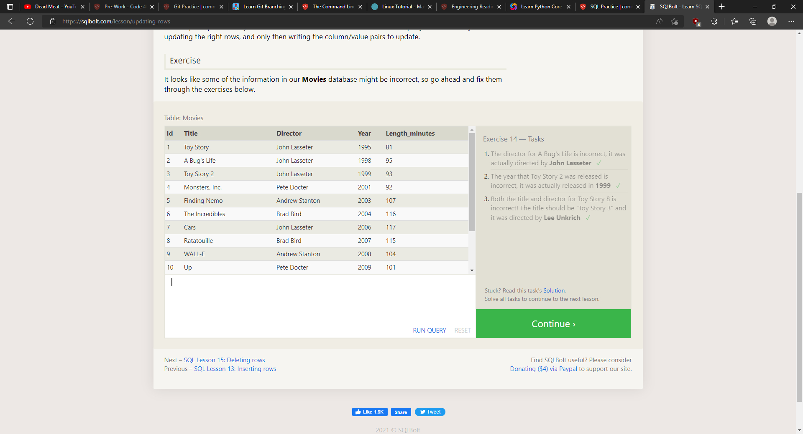
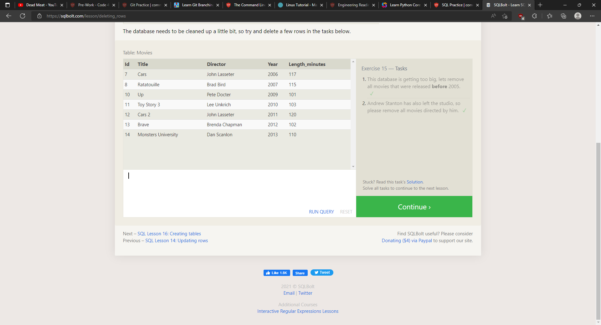
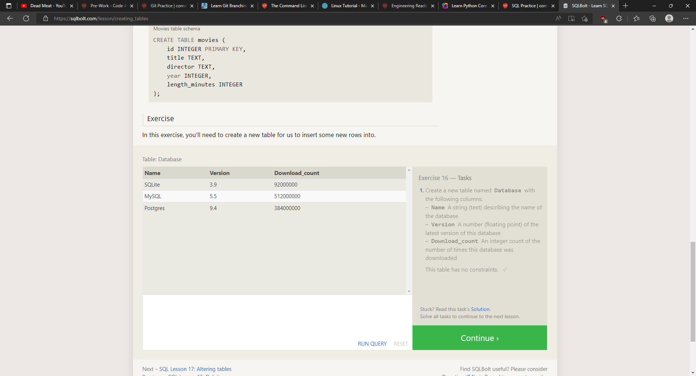
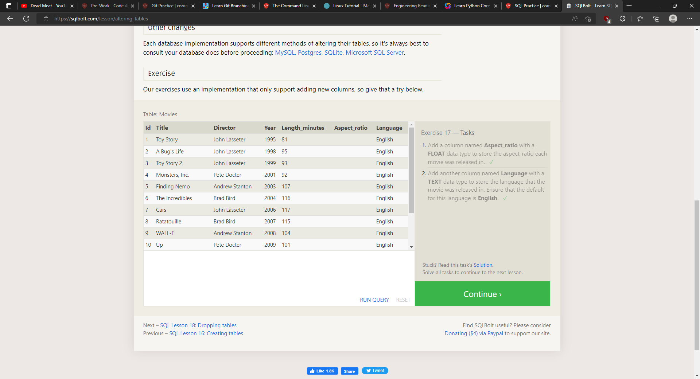
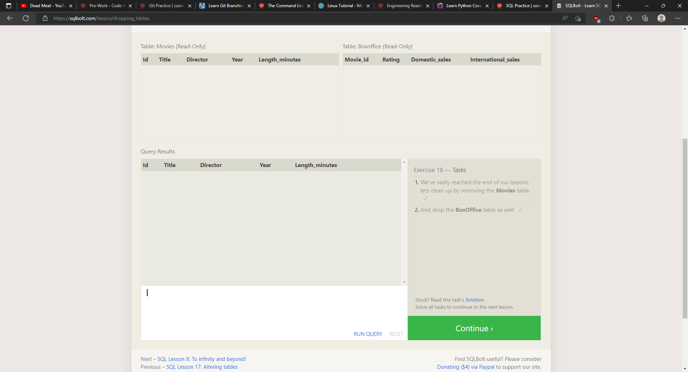

[`[`< table of contents`]`](code401.md)

[`[`< home`]`](README.md)
